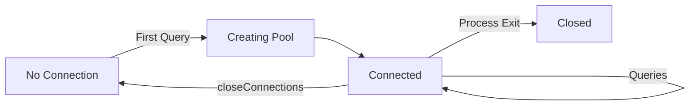

## Overview

Esix handles database connections automatically behind the scenes. When you run your first query, Esix establishes a connection to MongoDB and maintains a connection pool for optimal performance. You don't need to manually create, manage, or close connections in your application code.

## Automatic Connection Management

Connections are established lazily on first use:

```typescript
import { BaseModel } from 'esix'

class User extends BaseModel {
  public name = ''
  public email = ''
}

// No connection yet - just defining the model

// Connection is automatically created on first query
const users = await User.all() // ← Connection established here

// Subsequent queries reuse the same connection pool
const user = await User.find('507f1f77bcf86cd799439011')
const activeUsers = await User.where('isActive', true).get()
```

<Note>
  You never need to call `connect()` or worry about when to establish a connection. Esix handles this automatically.
</Note>

## Connection Pooling

Esix uses MongoDB's built-in connection pooling to efficiently manage database connections:

### How It Works

1. **Pool Creation**: On the first database operation, Esix creates a connection pool
2. **Connection Reuse**: Subsequent queries reuse connections from the pool
3. **Concurrency**: Multiple simultaneous queries use different connections from the pool
4. **Automatic Management**: Connections are kept alive and recycled automatically

### Pool Configuration

Control the maximum pool size with the `DB_MAX_POOL_SIZE` environment variable:

```bash
# Default: 10 connections
export DB_MAX_POOL_SIZE="10"

# High-traffic application: 25-50 connections
export DB_MAX_POOL_SIZE="25"
```

<Tip>
  Start with the default of 10 connections. Increase if you have many concurrent requests.
</Tip>

### Pool Size Guidelines

| Application Type | Suggested Pool Size |
|------------------|--------------------|
| Development | 5-10 |
| Low traffic API | 10-15 |
| Medium traffic API | 15-25 |
| High traffic API | 25-50 |
| Background workers | 5-10 per worker |

<Warning>
  MongoDB Atlas has connection limits based on cluster tier. Check your tier's limits before increasing pool size.
</Warning>

## Connection Handler

The `ConnectionHandler` class manages all database connections. While you rarely need to interact with it directly, it's available for advanced use cases:

```typescript
import { connectionHandler } from 'esix'

// Get the active database connection
const db = await connectionHandler.getConnection()

// Access MongoDB API directly if needed
const collection = db.collection('users')
const result = await collection.findOne({ email: 'john@example.com' })
```

### Closing Connections

For graceful shutdowns, you can manually close connections:

```typescript
import { connectionHandler } from 'esix'

process.on('SIGTERM', async () => {
  console.log('Shutting down gracefully...')
  await connectionHandler.closeConnections()
  process.exit(0)
})

process.on('SIGINT', async () => {
  console.log('Shutting down gracefully...')
  await connectionHandler.closeConnections()
  process.exit(0)
})
```

<Note>
  Calling `closeConnections()` closes all connections in the pool. The next query will automatically create a new pool.
</Note>

## Connection States

Esix connection lifecycle:



1. **No Connection**: Initial state before any queries
2. **Creating Pool**: Connection pool is being established
3. **Connected**: Pool is active and ready for queries
4. **Closed**: Connections have been manually closed

## Database Access

Esix provides a consistent way to access your MongoDB database:

### Through Models

The recommended approach is using model methods:

```typescript
import { User, BlogPost } from './models'

// All queries automatically use the configured connection
const users = await User.all()
const posts = await BlogPost.where('published', true).get()
```

### Direct Database Access

For advanced use cases, access the database directly:

```typescript
import { connectionHandler } from 'esix'

const db = await connectionHandler.getConnection()

// Use MongoDB's native API
const collection = db.collection('analytics')
await collection.createIndex({ userId: 1, timestamp: -1 })

const stats = await collection.aggregate([
  { $match: { userId: 'user123' } },
  { $group: { _id: '$eventType', count: { $sum: 1 } } }
]).toArray()
```

## Connection Adapters

Esix supports two connection adapters:

### Default Adapter

Uses the official MongoDB Node.js driver:

```bash
export DB_ADAPTER="default"  # or omit for default
export DB_URL="mongodb://localhost:27017/myapp"
```

This is the production adapter you'll use in development and production environments.

### Mock Adapter

Uses an in-memory mock database for testing:

```bash
export DB_ADAPTER="mock"
export DB_DATABASE="test-db"
```

```typescript
import { describe, beforeEach, it, expect } from 'vitest'
import { User } from './models/user'

describe('User model', () => {
  beforeEach(() => {
    process.env.DB_ADAPTER = 'mock'
    process.env.DB_DATABASE = 'test'
  })

  it('creates users', async () => {
    const user = await User.create({ name: 'Test User' })
    expect(user.id).toBeDefined()
  })
})
```

The mock adapter:
- Runs entirely in memory
- Doesn't require a MongoDB server
- Resets between test runs
- Provides fast, isolated tests

<Tip>
  Use the mock adapter for unit tests and the default adapter for integration tests.
</Tip>

## Connection Errors

Esix provides clear error messages for connection issues:

### Invalid Adapter

```typescript
process.env.DB_ADAPTER = 'postgres'

// Error: postgres is not a valid adapter name. Must be one of 'default', 'mock'.
```

### Connection Failure

```typescript
process.env.DB_URL = 'mongodb://invalid-host:27017'

try {
  await User.all()
} catch (error) {
  console.error('Connection failed:', error.message)
  // Handle connection error
}
```

## Best Practices

<CardGroup cols={2}>
  <Card title="Let Esix Manage Connections" icon="wand-magic-sparkles">
    Don't manually create or manage connections. Let Esix handle it automatically.
  </Card>
  
  <Card title="Configure Pool Size" icon="sliders">
    Set `DB_MAX_POOL_SIZE` based on your application's concurrency needs.
  </Card>
  
  <Card title="Handle SIGTERM" icon="power-off">
    Implement graceful shutdown to close connections properly.
  </Card>
  
  <Card title="Use Mock for Tests" icon="flask">
    Use the mock adapter for fast, isolated unit tests.
  </Card>
</CardGroup>

## Advanced: Multiple Databases

While Esix doesn't natively support multiple simultaneous connections, you can switch databases:

```typescript
import { connectionHandler } from 'esix'

// Function to switch databases
async function switchDatabase(databaseName: string) {
  // Close existing connection
  await connectionHandler.closeConnections()
  
  // Update database name
  process.env.DB_DATABASE = databaseName
  
  // Next query will connect to the new database
}

// Multi-tenant example
await switchDatabase('tenant-1')
const tenant1Users = await User.all()

await switchDatabase('tenant-2')
const tenant2Users = await User.all()
```

<Warning>
  Switching databases requires closing and reopening connections, which has a performance cost. Use this pattern sparingly.
</Warning>

## Performance Optimization

### Connection Reuse

Connections are automatically reused across queries:

```typescript
// All these queries reuse connections from the pool
const users = await User.all()          // Uses connection 1
const posts = await BlogPost.all()      // Uses connection 2
const products = await Product.all()    // Uses connection 3

// If pool size is 10, up to 10 concurrent queries can run
await Promise.all([
  User.count(),
  BlogPost.count(),
  Product.count(),
  Order.count()
  // ... up to 10 concurrent queries
])
```

### Connection Warm-up

For faster first requests in production, warm up the connection pool:

```typescript
import { connectionHandler } from 'esix'

// During application startup
async function warmUpConnections() {
  console.log('Warming up database connections...')
  await connectionHandler.getConnection()
  console.log('Database ready')
}

// Call during app initialization
await warmUpConnections()
```

## Monitoring

Monitor connection health in your application:

```typescript
import { connectionHandler } from 'esix'

// Health check endpoint
app.get('/health', async (req, res) => {
  try {
    const db = await connectionHandler.getConnection()
    await db.admin().ping()
    res.json({ status: 'ok', database: 'connected' })
  } catch (error) {
    res.status(503).json({ status: 'error', database: 'disconnected' })
  }
})
```

## Next Steps

<CardGroup cols={2}>
  <Card title="Configuration" icon="gear" href="/configuration">
    Learn about all configuration options
  </Card>
  
  <Card title="Models" icon="database" href="/models">
    Start defining your data models
  </Card>
  
  <Card title="Testing" icon="flask" href="/testing">
    Set up your test environment
  </Card>
  
  <Card title="Querying" icon="magnifying-glass" href="/retrieving-models">
    Learn how to query your data
  </Card>
</CardGroup>
